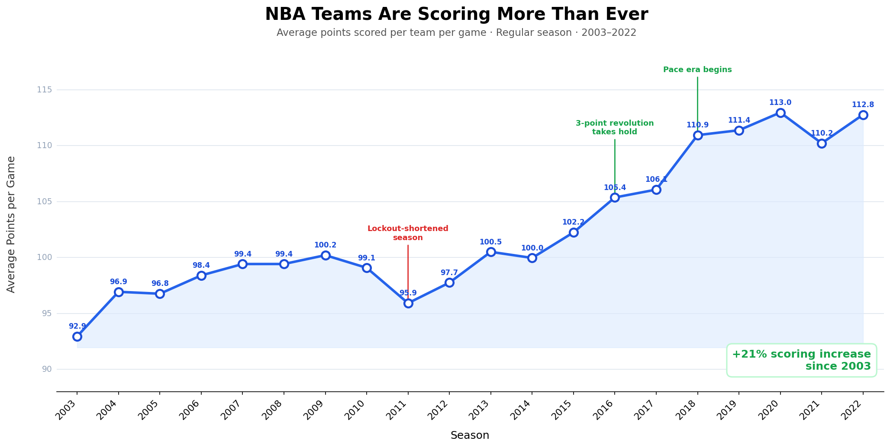
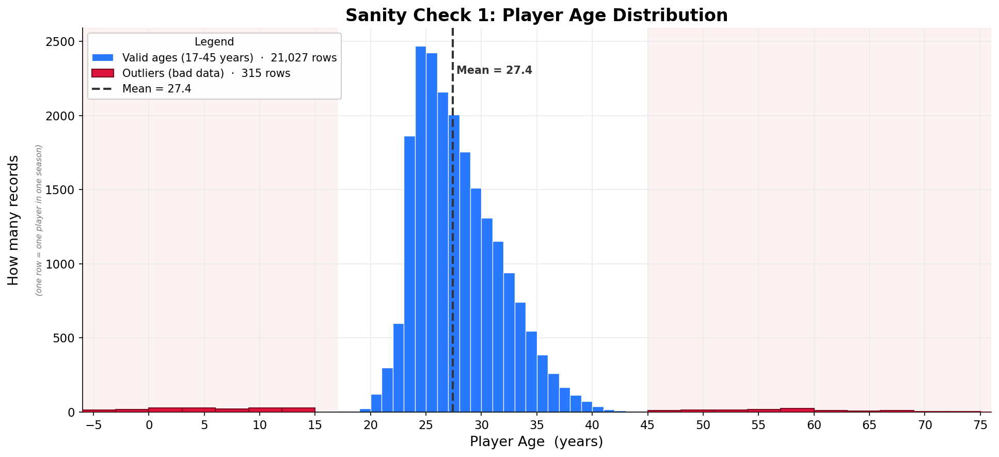

# NBA Data Science

A data science project exploring three questions about NBA player and team performance.

## Research Questions

1. **Q1 — Predicting a player's next game.** Can we use past performance, rest days, opponent strength, and home/away context to predict how a player will perform tomorrow?
2. **Q2 — Team chemistry.** Can a team's success be explained by the *composition* of its roster (age mix, experience, nationality, draft pedigree, star power, salary distribution)?
3. **Q3 — Playoffs vs. regular season.** Which players raise their game in the playoffs, which ones fall off, and what do the risers have in common?

---

## Repo structure

```
NBA_Data_Science/
├── data_pipeline/
│   ├── Kaggle/          # fetch_nba_data.py, fetch_supplemental_data.py
│   ├── NBA_api/         # nba_data_collector.py
│   └── BRef/            # BasketballRefMainScraper.py, BasketballRefPlayoffScraper.py
├── data/processed/
│   ├── Kaggle/          # 11 CSVs — historical stats, salaries, combine, bios
│   ├── NBA_api/         # box scores, game logs, season stats, rosters (2019–2025)
│   └── BRef/            # per-team CSVs scraped from Basketball Reference (1,272 files)
├── visualizations/      # playoff_risers_decliners.py, sanity_checks.py, team_scoring_trend.py
├── figures/             # output plots (PNG)
└── requirements.txt
```

---

## Data sources

### 1. Kaggle (5 datasets)
Downloaded via the Kaggle API using `data_pipeline/Kaggle/fetch_nba_data.py` and `fetch_supplemental_data.py`.

| Dataset | Years | What it has |
|---|---|---|
| `nathanlauga/nba-games` | 2003–2022 | Per-game player box scores + team standings |
| `wyattowalsh/basketball` | 1946–2023 | SQLite DB: draft history, player bio, advanced stats, combine measurements |
| `drgilermo/nba-players-stats` | 1950–2017 | Season-level advanced metrics (PER, WS, VORP) |
| `bendikfltaas/nba-history-seasonal-data-1995-2023` | 1995–2023 | Playoff + regular season scoring averages |
| `loganlauton/nba-players-and-team-data` | 1990–2022 | Player salaries + team payrolls |

Processed output → `data/processed/Kaggle/`

### 2. NBA API
Fetched using the official NBA stats API via `data_pipeline/NBA_api/nba_data_collector.py`. Covers seasons **2019-20 through 2024-25**, both regular season and playoffs.

Includes:
- **Box scores** — traditional, advanced, misc (per season)
- **Player game logs** — base, advanced, usage
- **Team game logs** — base, advanced
- **Season stats** — base, advanced, defense, scoring, usage, hustle, clutch, estimated metrics, standings
- **Player profiles** — career stats, awards, bio info
- **Reference tables** — all players, all teams, draft history, rosters

Processed output → `data/processed/NBA_api/`

### 3. Basketball Reference (BRef)
Scraped using `data_pipeline/BRef/BasketballRefMainScraper.py` and `BasketballRefPlayoffScraper.py`. Produces one set of CSVs per team per season in the format `{TEAM}_{YEAR}_{type}.csv`, where type is one of: `advanced`, `games`, `pbp`, `per_game`, `roster`, `salaries`, `team_misc`.

Processed output → `data/processed/BRef/` (1,272 files)

---

## How to reproduce

```bash
pip install -r requirements.txt

# Kaggle data (requires KGAT token at ~/.kaggle/access_token)
python data_pipeline/Kaggle/fetch_nba_data.py
python data_pipeline/Kaggle/fetch_supplemental_data.py

# NBA API data
python data_pipeline/NBA_api/nba_data_collector.py

# Basketball Reference scraper
python data_pipeline/BRef/BasketballRefMainScraper.py
python data_pipeline/BRef/BasketballRefPlayoffScraper.py

# Visualizations
python visualizations/sanity_checks.py
python visualizations/playoff_risers_decliners.py
python visualizations/team_scoring_trend.py
```

---

## Visualizations

| File | What it shows |
|---|---|
| `figures/fig1_age_sanity.png` | Player age distribution — confirms realistic range, flags bad-data rows |
| `figures/fig2_points_sanity.png` | Points per game per season (violin plots) — confirms no impossible values |
| `figures/playoff_risers_decliners.png` | Dumbbell plot: top 10 playoff risers vs top 10 decliners (change in scoring) |
| `figures/team_scoring_trend.png` | Line chart: average team score per game by season (2003–2022) |
| `figures/nba_age_distribution.pdf` | NBA player age distribution by era ([view PDF](figures/nba_age_distribution.pdf)) |

### NBA Team Scoring Over Time (2003–2022)



### NBA Player Age Distribution


